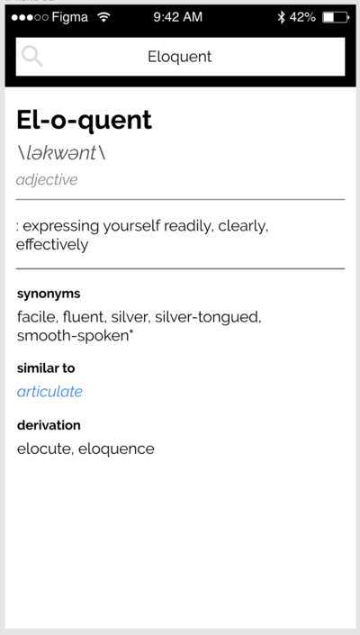

# Eloquent Dictionary

A simple dictionary app built on React and Words API.

## Wireframe

## Components
### SearchBar
- `word` - the search input
- `onInputChange` - event when the search input is changed
- `onSearchAction` - event when the search is executed

### Result
- `word` - the search input
- `data` - the result data from the API
- `error` - the error returned from calling the API

## Deployment
### Netlify
- Build command - `npm install && npm run build`
- Publish directory - `build`
- Build environment variables - refer to .env file